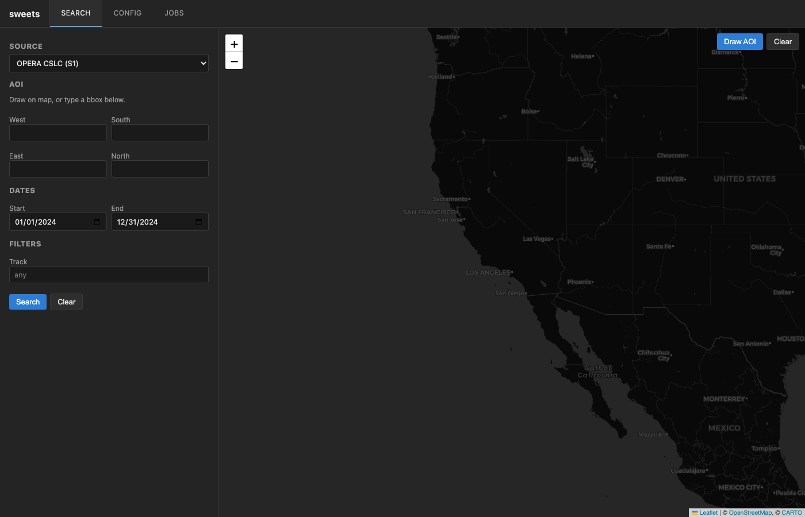
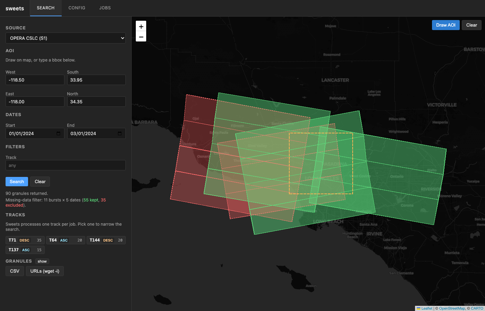
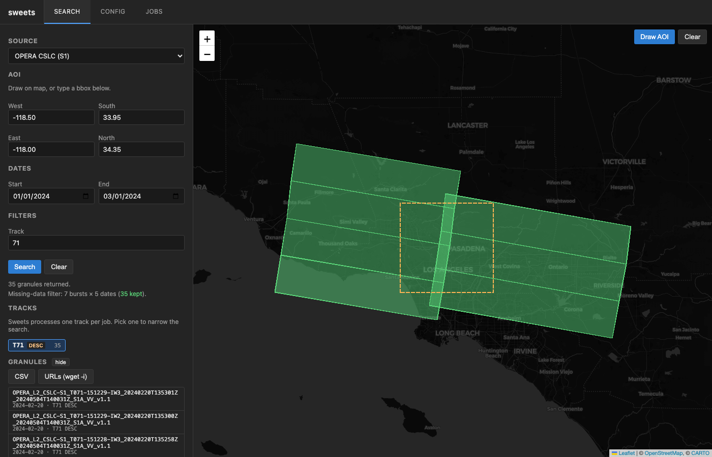
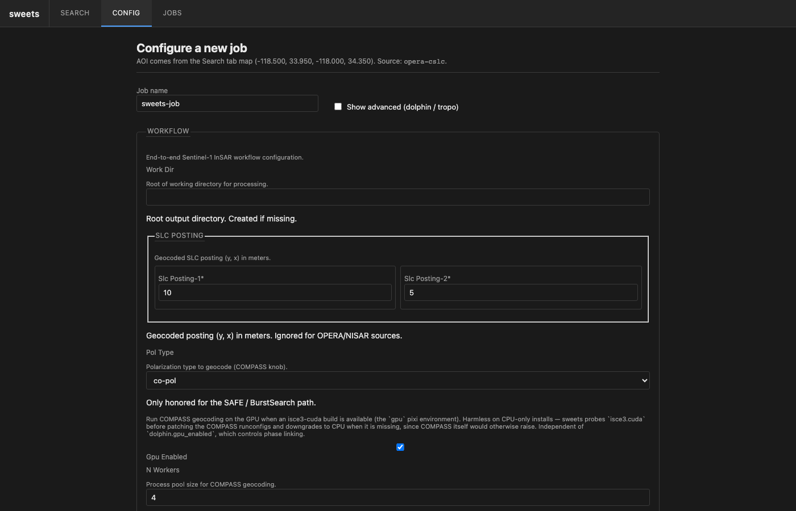
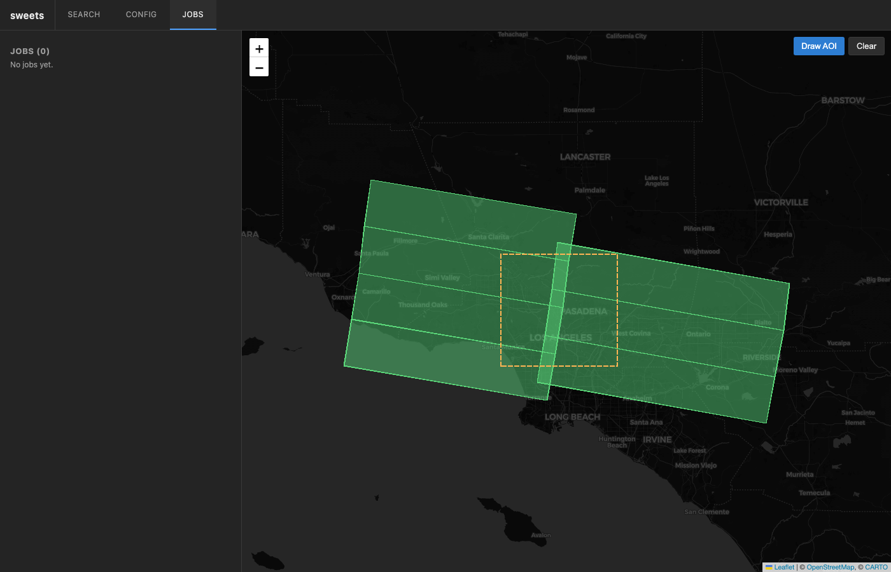

# sweets web UI

FastAPI backend + React/TypeScript frontend for the sweets InSAR workflow.

## What it does

1. **Search** — query CMR / ASF for OPERA CSLC bursts, Sentinel-1 SLC bursts,
   or NISAR GSLC frames covering a map-drawn AOI + date range, and overlay
   the granule outlines on the map. Runs the same missing-data filter sweets
   uses on the actual download so the user sees, *before* kicking anything
   off, which bursts will be kept (green) vs dropped as partial coverage
   (red).
2. **Config** — render a form from `Workflow.model_json_schema()` via
   `@rjsf/core`, so every Workflow / Dolphin / Tropo field is exposed
   without hand-written form code.
3. **Monitor** — start a job, stream its logs over a WebSocket, watch the
   step bar tick through download → geocode → ifg → stitch → unwrap.
4. **View** — once a job finishes, hand off to
   [`bowser`](https://github.com/scottstanie/bowser) via
   `bowser setup-dolphin <work_dir>/dolphin` (button in the job detail).

## Screenshots

**Search (empty)** — pick a source, type or draw an AOI, set a date range.



**Search (results)** — real OPERA CSLC query over Los Angeles, Jan–Mar 2024
(`bbox=[-118.5, 33.95, -118.0, 34.35]`). 39 granules from two tracks: T144 DESC
(26) and T71 ASC (13). The missing-data filter picked the 7-burst × 4-date
subset that forms a coherent stack — **28 green features kept, 11 red features
excluded**. The dashed orange box is the requested AOI.



**Narrow to one track** — sweets only processes a single track per job; clicking
a track chip in the sidebar re-runs the search filtered to that track. Here
we picked T144 DESC, so the ascending stack drops out:


**Granule list + export** — expand the list of returned granules, or grab the
whole set as a CSV or a newline-separated URL list suitable for `wget -i`:



**Config (full-page)** — form auto-generated from `Workflow.model_json_schema()`.
The basic view shows the knobs most users actually touch; "Show advanced"
exposes the full nested dolphin / tropo configs. AOI + source come from the
Search tab, not the form.



**Jobs** — list, step-bar progress, WebSocket log tail, results manifest, and a
"View in bowser" button that shells `bowser setup-dolphin <work_dir>/dolphin`.



## Layout

```
src/sweets/web/
├── app.py                       FastAPI factory (routers + static mount)
├── api/
│   ├── jobs.py                  Job CRUD + start/cancel
│   ├── websocket.py             /api/ws/jobs/{id}/logs
│   ├── schema.py                /api/schema  -> Workflow JSON schema
│   ├── search.py                /api/search  -> granule GeoJSON
│   └── results.py               /api/jobs/{id}/manifest + /view (bowser)
├── models/                      SQLModel job persistence (SQLite)
├── services/
│   ├── executor.py              Background `sweets run` subprocess
│   └── log_manager.py           Per-job line buffer + WebSocket pub/sub
└── frontend/                    React 18 + TS + Vite + Leaflet
    ├── package.json
    ├── tsconfig.json
    ├── vite.config.ts           Proxies /api -> localhost:8000
    └── src/
        ├── main.tsx
        ├── App.tsx              Sidebar tabs + map shell
        ├── api.ts               Typed fetch wrappers
        ├── state.tsx            React context (tab, bbox, source, ...)
        ├── style.css            Bowser-inspired dark theme
        └── components/
            ├── MapView.tsx      Leaflet + leaflet-draw rectangle + overlay
            ├── SearchPanel.tsx  Source / dates / track / frame search
            ├── ConfigPanel.tsx  RJSF schema-driven form
            └── JobsPanel.tsx    List + step bar + logs + manifest + bowser
```

## API

| Method | Path                              | Purpose                          |
| ------ | --------------------------------- | -------------------------------- |
| GET    | `/api/health`                     | Liveness                         |
| GET    | `/api/schema`                     | `Workflow.model_json_schema()`   |
| POST   | `/api/search`                     | Granule GeoJSON for an AOI       |
| GET    | `/api/jobs/`                      | List jobs                        |
| POST   | `/api/jobs/`                      | Create job                       |
| POST   | `/api/jobs/{id}/start`            | Spawn `sweets run` subprocess    |
| POST   | `/api/jobs/{id}/cancel`           | SIGTERM the subprocess           |
| GET    | `/api/jobs/{id}/manifest`         | List interesting output files    |
| POST   | `/api/jobs/{id}/view`             | `bowser setup-dolphin` handoff   |
| WS     | `/api/ws/jobs/{id}/logs`          | Live log stream                  |

## Dev loop

```bash
# Backend (needs the optional web extras)
pip install -e ".[web]"
sweets server --reload                       # uvicorn on :8000

# Frontend (separate terminal)
cd src/sweets/web/frontend
npm install
npm run dev                                  # Vite on :5173, proxies /api
```

Open http://localhost:5173. Vite proxies `/api` and `/api/ws/*` through to
the backend, so the React app behaves identically to a production build.

## Production

```bash
cd src/sweets/web/frontend
npm install && npm run build                 # writes ./dist
cd -
sweets server --host 0.0.0.0 --port 8000     # serves dist/ as static
```

## Storage

Jobs are persisted in `~/.sweets/sweets.db` (SQLite). The `config` column
holds the full Workflow YAML as JSON; `work_dir` is denormalized onto the
row when the job starts so the manifest / bowser endpoints can find it
without re-parsing the config.

## What's intentionally minimal

- **Auth**: none. This is a local-first dev tool; bind to `127.0.0.1` and
  don't expose it publicly.
- **CSS**: hand-rolled bowser-style dark theme. No Tailwind / MUI / etc.
- **Form UX**: RJSF default widgets. Replace per-field with custom widgets
  if/when the auto-generated layout gets unwieldy.
- **Results viewer**: handed off to `bowser` rather than reimplemented.
  The `/api/jobs/{id}/view` endpoint runs `bowser setup-dolphin` so the
  user lands directly in the mature viewer.
